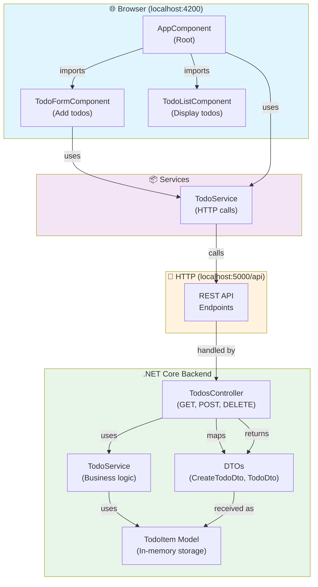

# todo-api-angular

Small Angular frontend for the TODO API.

Prerequisites
- Node.js 20+ and npm.
- Angular CLI 16 is optional if available.

Run

```bash
cd todo-api-angular
npm install
npm start
```

The app will serve on `http://localhost:4200` by default.

Run order
- Start `todo-api-dotnetcore` first.
- Then run this frontend so it can call `http://localhost:5000/api`.

API
- The frontend calls the backend at `http://localhost:5000/api`.
- If you need to point it somewhere else, update `src/environments/environment.ts` and `src/environments/environment.prod.ts`.

Tests

```bash
npm test
```

## Architecture



## Features

- **Rich Text Editor** - Format descriptions with bold, italic, underline, and font size options
- **Responsive UI** - Clean card-based interface with proper alignment
- **Component-based** - Modular Angular standalone components
- **RESTful API** - Stateless backend with CRUD operations
- **Real-time Sync** - Changes instantly reflect between frontend and backend

Notes
- The backend must be running separately on port `5000`.
- Data is stored in-memory on the backend, so restarting the API clears the todo list.
