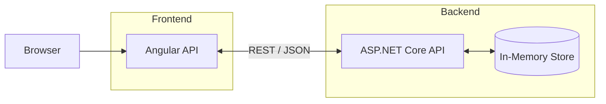

# todo-api-angular

A lightweight Angular application that provides a simple user interface for the TODO API. It allows you to create, view, and delete TODO items by communicating with the ASP.NET Core backend.

## Prerequisites

Before running the application, make sure you have:

* Node.js 20 or later
* npm (included with Node.js)

> **Optional:** Angular CLI 16 can be installed globally if you prefer using Angular CLI commands, but it isn't required.

## Getting Started

From the project directory, run:

```bash
cd todo-api-angular
npm install
npm start
```

The application will be available at:

```text
http://localhost:4200
```

## Running with the Backend

This frontend depends on the ASP.NET Core API.

1. Start the **todo-api-dotnetcore** project first.
2. Once the backend is running, start this Angular application.

By default, the frontend communicates with:

```text
http://localhost:5000/api
```

If your backend is running on a different URL or port, update the API endpoint in:

* `src/environments/environment.ts`
* `src/environments/environment.prod.ts`

## Running Tests

Execute the unit tests with:

```bash
npm test
```

## Application Architecture




## Features

* Create, view, and delete TODO items through a clean and responsive interface.
* Rich text editor for formatting task descriptions (bold, italic, underline, and font size).
* Built using Angular standalone components for a modular architecture.
* Communicates with the backend through REST APIs.
* Changes are reflected immediately after each successful API request.

## Notes

* The backend API must be running separately on **[http://localhost:5000](http://localhost:5000)**.
* The backend uses an in-memory data store, so all TODO items are cleared whenever the API is restarted.


